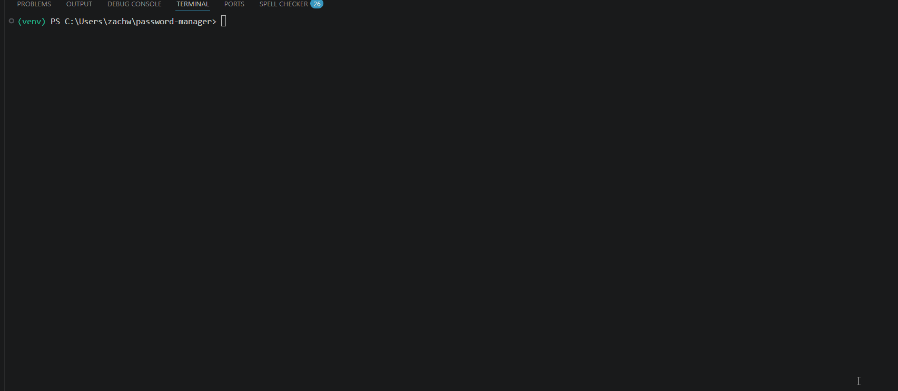

# ZW Vault — Password Manager

I built this because I wanted to actually understand how password managers work not just use one. Everything is encrypted locally meaning nothing leaves your computer.

## What it does
- Encrypts every password with AES before saving it
- Master password is hashed with SHA-256, even I can't read it
- Hides input while you type so nothing shows on screen
- Locks you out after 3 wrong attempts
- Generates strong passwords so you don't have to think of one
- Tells you if your password is weak, medium, or strong
- Copies passwords straight to your clipboard — never displayed unless you ask
- Lets you search by partial site name
- Keeps a history of old passwords with timestamps
- Asks for confirmation before deleting anything
- Can export your vault with a timestamp header

## Security concepts I learned building this
- Encryption at rest with Fernet (AES-128)
- Password hashing with SHA-256
- Brute force protection
- Secure key management
- Safe clipboard handling

## How to run it

```bash
git clone https://github.com/zachwenger/password-manager
cd password-manager
python -m venv venv
venv\Scripts\activate
pip install cryptography pyperclip colorama
python manager.py

## What this taught me

This was a very interesting python project. I had to figure out how encryption actually works, not just use a library blindly, understanding why you hash a master password differently from how you encrypt stored passwords was definitely something new that ive never learnt before. The hardest part was getting the key management right so passwords survive closing and reopening the program. This was overall super fun and a great experience, despite it being somewhat tedious.
